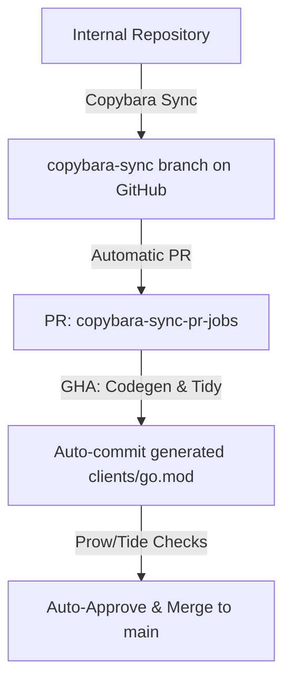

# GKE Enterprise Multi-Tenancy Framework

This repository implements a controller framework for managing multi-tenant Kubernetes controllers in GKE Enterprise.

## Overview

The core of this project is a "meta-controller" or **Manager** that dynamically starts and stops sets of controllers for each tenant. Tenants are defined by `ProviderConfig` resources. This approach ensures strict isolation and lifecycle management for tenant-specific logic.

## Architecture

### ProviderConfig

The `ProviderConfig` Custom Resource Definition (CRD) acts as the source of truth for a tenant's configuration. It controls the lifecycle of tenant-specific controllers.

### Framework Manager

The Manager (`pkg/framework/manager.go`) watches `ProviderConfig` objects.

- **On Add/Update**: It spins up a new set of controllers (e.g., NodeController, IPAMController) dedicated to that tenant.
- **On Delete**: It ensures all tenant-specific controllers are stopped and cleans up resources (via Finalizers) before allowing the `ProviderConfig` to be deleted.
- **Idempotency**: The manager ensures that repeated events do not trigger duplicate controller startups.

### Isolation

Controllers are "scoped" to their tenant to ensure they only process resources (like Nodes) belonging to that tenant. This is achieved through:

- **Filtered Informers**: Ensuring controllers only see objects matching specific labels or fields.
- **Scoped Clients**: Restricting API access where possible.

## Directory Structure

| Directory | Description |
|-----------|-------------|
| `pkg/apis/` | Kubernetes API definitions (CRDs), specifically `ProviderConfig`. |
| `pkg/framework/` | Core logic for the controller manager and lifecycle coordination. |
| `pkg/providerconfig/` | Client sets, listers, and informers for the custom resources. |
| `pkg/utils/` | Shared utilities for workqueues and common patterns. |
| `pkg/finalizer/` | Helper logic for managing Kubernetes finalizers. |

## Development

### Prerequisites

- Go 1.25.5+
- Kubernetes environment (or test setup)

### Build

To build the project:

```bash
make build
```

### Test

To run unit and race detection tests:

```bash
make test
```

### Utilities

- `make fmt`: Format code
- `make tidy`: Tidy Go modules
- `make vet`: Run `go vet`

## Development Workflow & Sync Pipeline

This repository is a public mirror of an internal Google repository. The core codebase is developed internally, and changes are synchronized to GitHub automatically.

### Sync Architecture



1. **Source of Truth:** The core files under `pkg/apis/`, `pkg/filteredinformer/`, and `pkg/framework/` are managed internally.
2. **Copybara Sync:** Internal changes are synced to the `copybara-sync` branch on GitHub, which automatically opens a PR to `main`.
3. **Automated Codegen:** A GitHub Action triggers on the PR to run Kubernetes codegen (`hack/update-codegen.sh`) and `go mod tidy`, committing the results back to the PR branch.
4. **Auto-Approval:** The PR is automatically approved via Prow (using `gke-mt-bot`) and merged once status checks pass.

### Caveats & Contribution Rules

> [!IMPORTANT]
> **Code Lock:** Do not attempt to modify files under `pkg/apis/`, `pkg/filteredinformer/`, or `pkg/framework/` directly via GitHub Pull Requests. These directories are locked. Any PR attempting to modify them directly will fail the pre-merge policy checks.
>
> To modify these files, changes must be submitted to the internal repository first.

- **GitHub-Only Changes:** You *can* submit PRs for GitHub-specific files (e.g., `.github/workflows/*`, `README.md`, `Makefile`, `OWNERS`).
- **Version Bumping:** If you modify GitHub-only files, you **must increment** the version in [pkg/VERSION](file:///usr/local/google/home/panpr/repos/gke-enterprise-mt-fork/pkg/VERSION) in your PR to trigger a release tag (unless you include `NO_VERSION_BUMP` in the PR description).
- **Downgrade Protection:** Copybara sync PRs will fail if the version in the sync branch is lower than the version currently on `main`.
